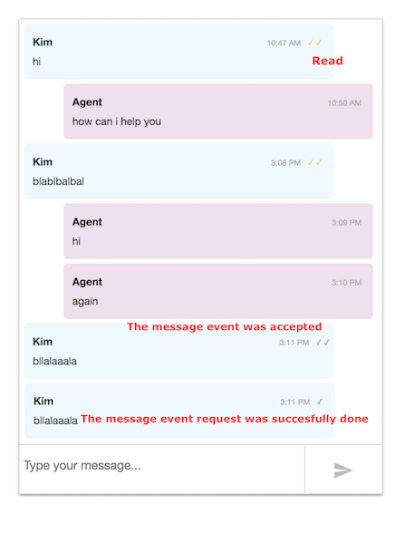

All sample applications and code are made available to you for
informational purposes only and any use is at your own risk.  LivePerson
makes no representation or warranty     regarding their accuracy,
reliability or use and makes no commitment that they will be free of
inaccuracies, errors, bugs or interruptions.  LivePerson will not be
liable for any claims,  damages or liability related to the sample
applications and code or your use of them.

# Connector App Hub (Demo App for Connector API)

This project contains a demo application for the Connector API witch allows you to manage your apps and create a demo conversation within a consumer and an agent. 

Look at [Connector API getting started](https://developers.liveperson.com/connector-api-getting-started.html) for a better
understanding.

---
`Important!`

This app ONLY should be used with TEST ACCOUNTS, it could compromise your sensitive data. Since this app is not using
any database, potential sensitive data is saved in your browser local storage (AppID and ConversationID).

## Table of Contents
  - [Requirements](#requirements)
  - [Installation](#installation)
  - [How to make it running locally](#how-to-make-it-running-locally)
    - [Running NgRok](#running-ngrok)
    - [Running with Docker](#running-with-docker)
  - [Usage](#usage)
    - [Create a new app](#create-a-new-app)
      - [Advanced Webhooks configuration](#advanced-webhooks-configuration)
      - [Engagement configuration](#engagement-configuration)
    - [Enable, Disable and Uninstall](#enable-disable-and-uninstall])
    - [Edit an existing app](#edit-an-existing-app)
    - [Demo app](#demo-app)
      - [Create conversation](#create-conversation)
      - [File sharing](#file-sharing)
      - [Auto-messages](#auto-messages)
      - [Post Conversation Survey](#post-conversation-survey)
  - [Settings](#settings)
    - [Configuring the webhooks endpoints](#configuring-the-webhooks-endpoints)
    - [Web environment files](#Web-environment-files)
  - [Development Mode](#development-mode)
    - [Project structure](#project-structure)
    - [Sending and handling conversation events](#sending-and-handling-conversation-events)
      - [Message sequence number](#message-sequence-number)
      - [Chat state events](#chat-state-events)
      - [Message status events](#message-status-events)
  - [Deployment](#Deployment)
    - [Configuring Nginx](#Configuring-Nginx)
    - [Nginx configuration sample file](#Nginx-configuration-sample-file)
  

## Requirements.

- Node 6.9.0 or higher, together with NPM 3 or higher.
- [Angular CLI](https://cli.angular.io/) 1.7.3 or higher. 
- A valid brandID with _Async prop Messaging_ enabled.
- An installed APP for your brandID with the data sources configured in LiveEngage. 
- Your server must be accessible if you want to receive events from Webhooks. Or you can use a tool to redirect all the
 notifications from outside to your internal network.
  * (optional). Use [NgRok](#running-ngrok) for redirecting the Webhooks notifications from internet to your local host.
  Run it with the port 8282 by default ```./ngRok http 8282``` .

## Installation

In order to install the project dependencies type this command in a terminal from the root folder where the project is located:

 ```npm install``` 

## How to make it running locally

1. ```npm run start-local``` will build the project and start the server.
1. Open ``` http://localhost:8282``` in your browser. 
1. Log in with a valid LE account.

### Running NgRok

  You can use [NgRok](https://ngrok.com/) as an optional tool for redirecting the Webhooks notifications from the internet to your local host.
  The default port that we use in our server is 8282. To run it, you have to [download](https://ngrok.com/download) and execute the following command (in the same directory):
  
  ```./ngRok http 8282``` 
  


### Running with Docker

Requirements: [Docker](https://www.docker.com/products/docker-desktop) installed and running in your computer. 

1. Create the image ```docker build -t demo-connector-app .```
2. Run the image ```docker run -p 8282:8282 -d demo-connector-app ```  
(After this command, You need to wait 1 or 2 minutes till be able to open the app in a browser)
3. Open ``` http://localhost:8282``` in your browser. 

## Usage

You must Login with a valid brand Id, user and password. If the login process was successful, the application will redirect you to the home page. This page contains a list of installed apps compatible with the Connector API.


### Create a new app

1. Click on "Create App" button. It will pop up a new dialog window.
1. You must fill up the required fields. Application name and description are the minimum required data (other required data is automatically added when you click on install). Note: If you select the "demo app" check box, it will provide you with this "app server endpoint" ready to test Webhooks notifications (demo). If desired, you can edit and change this application configuration later.
1. If all required fields are completed and the form is valid you will be able to click on install.

#### Advanced Webhooks configuration

 When you introduce an endpoint in the application Installation details form, it wil be automatically assigned to every kind of event.
  
  You can customize endpoints per event type in the "Advaced Webhooks configuration" form and add custom headers. (e.g. you can use different server to handle Content type Events)
 
 

#### Engagement configuration

 You can change the engagement properties of you app here. This affects the Engagement design possibilities when designing a campaign for messaging. The Default values are automatically assigned to you app if nothing is changed.

### Enable, Disable and Uninstall

Open the action menu of an app from a list and click on the desired action.

 
 
### Edit an existing app

  You can edit an existing app configuration: Open the actions menu of an app from the list and click on edit. After the changes are done, just click on update button.

### Demo app

  Open the action menu of the chosen app from the list and click on demo (if option available).
   
   Note: if you want to be able to receive Webhooks events you must add the demo app server url to the the selected App. Every Webhooks endpoint should be on the following format: ``https://{demo app server url}/notifications/event``

#### Create conversation

1. Type any message in order to start a conversation and press enter.
1. You can login with you account in LiveEngage platform (better to use another user for that brand in order to avoid conflicts), see the sent messages, Webhooks notifications etc. 

[Note!!] Before starting a conversation, you can select some headers that will be sent in every request, It can be use for example, to activate the Auto-messages feature. Also you can modify the Campaign Id or Skill.


#### File sharing

First you need to enable the file sharing feature for your account, [click here for more information](https://developers.liveperson.com/messaging-window-api-tutorials-file-sharing.html#step-1---enable-file-sharing).

You can click on the open file button next to the chat box text input and select a valid file from your disk.

#### Auto messages

You should have configured properly the LE Auto-Messages feature before. Then You can select the AUTO_MESSAGES feature header and start a conversation. If everything was property configured you should receive your automatic messages.

#### Post Conversation Survey

Before being able to use this feature you should have properly a Survey Bot configured,
[click here for more information](https://developers.liveperson.com/messaging-window-api-tutorials-post-conversation-survey-pcs.html).

Before starting a new conversation you must enter the Survey Skill Id and select the features RICH_CONTENT, QUICK_REPLIES and MULTI_DIALOG. Then you must close the dialog by clicking on "Close conversation with PCS". If everything was property configured, you will receive the survey.


## Settings

Before running the app, maybe you want to change some configuration parameters in [settings.json](settings.json):

  1. [CSDS_DOMAIN] : The URL of the Domain API from which you can get the base URLs of any service (the production Domain API is set by default).
  1. [CSDS_DOMAIN_QA] : The URL of the Domain API  in QA.
  1. [SERVER_HTTP_PORT] : The port of the server listening for Webhooks notifications (this app server).
  
  
### Configure the Webhooks endpoints

In your app installation you need to add this webhook listener server url:

``https://{demo app server}/notifications/event``

NOTE: You would need to configure an HTTPS proxy server with valid certificates that redirect all request to http://localhost:8282/notifications/event
Webhooks require HTTPS.

## Development Mode:

Angular CLI provides a fast development server using Webpack. Every change is automatically refreshed in the browser.

To run the application using the dev server open a terminal and type the following:

1. ```node app``` to run the server
1. Open another terminal and type```npm run build-watch``` to build and watch for changes in the UI
1. Open ``` http://localhost:8282``` in your browser. All changes in the web folder would be reflected immediately after clicking on refresh.

### Project structure

- Server: NodeJS server used as notification server (receive Webhooks notifications and map it to the correct conversation).
The server is also used as a bridge to avoid Cross-Domain restrictions in the browser.
- Web app: Angular 8 project.

### Sending and handling conversation events

The demo connector app can handle most of the conversation events described in the 
[developers documentation](https://developers.liveperson.com/connector-api-examples-send-chat-state-events.html)
and especially in [send-endpoint section](https://developers.liveperson.com/connector-api-api-reference-send.html#mspublishevent-properties-2).

Most of those events are reflected in the UI, e.g. when a user is typing or a message is read.

####  Message sequence number

The sequence of every message is obtained after each request. A Message object is created with this sequence number. This
is very important to save in order to handle the message status events like READ, ACCEPT, etc.

```json
{
    "reqId": "1",
    "code": "OK",
    "body": {
        "sequence": 0
    }
}
```

#### Chat state events


 - COMPOSING: A request is sent with this event when consumer starts to typing in the chat box.
   Example of consumer request:
     ```json
    {  
       "kind":"req",
       "id":"1",
       "type":"ms.PublishEvent",
       "body":{  
          "dialogId":"b3aea67d-01ca-4bf7-af4f-9897cf6b77a7",
          "event":{  
             "type":"ChatStateEvent",
             "chatState":"COMPOSING"
          }
       }
    }
    
    ```
 
   Example of a received notification, in this case when agent is composing:
     ```json
       {
      "kind": "notification",
      "body": {
        "changes": [
          {
            "originatorId": "662eb2c6-cf25-5ea8-8fbd-9f1781558c24",
            "originatorMetadata": {
                   "id": "662eb2c6-cf25-5ea8-8fbd-9f1781558c24",
                   "role": "ASSIGNED_AGENT"
                 },
                 "event": {
                   "type": "ChatStateEvent",
                   "chatState": "COMPOSING"
                 },
                 "conversationId": "b3aea67d-01ca-4bf7-af4f-9897cf6b77a7",
                 "dialogId": "b3aea67d-01ca-4bf7-af4f-9897cf6b77a7"
               }
             ]
           },
           "type": "ms.MessagingEventNotification"
         }
    ```

     In order to show that the consumer has stopped typing, we need to pass any other state which is different 
     from COMPOSING (it does not matter which value you choose, as long as it is not COMPOSING) i.e. ACTIVE , INACTIVE, GONE, PAUSE.
     In this app, we pass a PAUSE event every time the consumer stops typing.
      
       

 
 - PAUSE: In this APP this event is sent after consumer stops typing.

 - ACTIVE: LiveEngage normally sends ACTIVE events after composing instead of PAUSE. In this app ACTIVE is sent
 when the window focus event is triggered. That happens when you are in the demo app tab or by clicking into the chat box after
 return from another window.
 
    Example received notification:
     ```json
    {
      "kind": "notification",
      "body": {
        "changes": [
          {
            "originatorId": "31fe13ba27250bfff439a6f875cfd135cf64f680f9dded3b123cb0529d1e5a29",
            "originatorMetadata": {
              "id": "31fe13ba27250bfff439a6f875cfd135cf64f680f9dded3b123cb0529d1e5a29",
              "role": "CONSUMER"
            },
            "event": {
              "type": "ChatStateEvent",
              "chatState": "ACTIVE"
            },
            "conversationId": "b3aea67d-01ca-4bf7-af4f-9897cf6b77a7",
            "dialogId": "b3aea67d-01ca-4bf7-af4f-9897cf6b77a7"
          }
        ]
      },
      "type": "ms.MessagingEventNotification"
    }
    ```
 - GONE: In this app, this event is sent when a window Blur event is triggered, that means when a user opens other tab or window.
 - INACTIVE: Not implemented for this app. It could be added easily and send a request after the user does not use the app for a 
determined period of time. 
 

#### Message status events 

The demo connector app also can handle most of the message status events, i.e. when a message is send, read or accepted.

- ACCEPT: This event request indicates to the agent the list of messages that were accepted.

  ```json
  {
    "kind": "req",
    "id": "1,",
    "type": "ms.PublishEvent",
    "body": {
      "dialogId": "88166f48-6254-496f-9508-96b044fc0442",
      "event": {
        "type": "AcceptStatusEvent",
        "status": "ACCEPT",
        "sequenceList": [
          2,3,5 
        ]
      }
    }
  }
    
  ```
  
- READ: This event request indicates to the agent the list of messages which were read.

  ```json
  {
    "kind": "req",
    "id": "1,",
    "type": "ms.PublishEvent",
    "body": {
      "dialogId": "88166f48-6254-496f-9508-96b044fc0442",
      "event": {
        "type": "AcceptStatusEvent",
        "status": "READ",
        "sequenceList": [
          2,3,5
        ]
      }
    }
  }
    
  ```
  
  When an agent has read some of your messages, you will get via Webhooks a notification like this:
  
  ```json
        {
    "kind": "notification",
    "body": {
      "changes": [
        {
          "sequence": 9,
          "originatorId": "662eb2c6-cf25-5ea8-8fbd-9f1781558c24",
          "originatorMetadata": {
            "id": "662eb2c6-cf25-5ea8-8fbd-9f1781558c24",
            "role": "ASSIGNED_AGENT"
          },
          "serverTimestamp": 1537343869240,
          "event": {
            "type": "AcceptStatusEvent",
            "status": "READ",
            "sequenceList": [
              6
            ]
          },
          "conversationId": "f66ad121-8dcb-4430-9fc2-731e961f6eae",
          "dialogId": "f66ad121-8dcb-4430-9fc2-731e961f6eae"
        }
      ]
    },
    "type": "ms.MessagingEventNotification"
  }
     
  ```
- NACK: Not implemented for this app.
- ACTION: Not implemented for this app.




## Deployment 

For a correct deployment of this app, we need to consider the following:

 -  A HTTPS server in order to be able to receive events via Webhooks.
 -  Valid certificates are needed in order to use the Webhooks service.
 -  A reverse proxy like Ngnix would redirect all HTTPS requests to our HTTP server. If we don't do this, the browser will block all HTTP requests considered not secure.
 -  Related to the previous point, we need to keep the properties protocol and port in `web/environment/environment.prod.ts` like defult: 
    
      ```
        ...
        protocol: "https",
        port: "",
        ...
      ```
 -  Run it with ```mpm start```. This will build the project with the production configuration.
  
### Configuring Nginx

 - Redirect all HTTP requests to HTTPS:

```
  http {
  ...
  server {
        listen       80;
        return 301 https://$host$request_uri;
     }
   
```
 - Redirect HTTPS requests to internal HTTP server and port: 
 ```
  server {
        listen       443 ssl http2 default_server;
        ...
        
        location / {		
                proxy_pass http://localhost:8282;
              }
        ...
 ```

 - Add valid certs in HTTPS server configuration: 

```
 server {
       listen       443 ssl http2 default_server;
       
       ...
       
       ssl on;   
       ssl_certificate "/your/path/to/file.pem";
       ssl_certificate_key "/your/path/to/file.key";
       ssl_session_cache shared:SSL:1m;
       ssl_session_timeout  10m;
       ssl_ciphers HIGH:!aNULL:!MD5;
       ssl_prefer_server_ciphers on;
       
       ...
```
 - Configuration for SSE (Server Send Events). We are sending the received events to the UI through SSE and we need 
it to work properly with Nginx:

```
       #This deals with the Aggregating issue
       chunked_transfer_encoding off;
       proxy_buffering off;
       proxy_cache off;

       #This deals with the connection closing issue
       proxy_set_header Connection keep-alive;
       proxy_connect_timeout 3600;
       proxy_send_timeout 3600;
       proxy_read_timeout 3600;
       keepalive_timeout 3600;
```

### Nginx configuration sample file 
```
user nginx;
worker_processes auto;
error_log /var/log/nginx/error.log;
pid /run/nginx.pid;

# Load dynamic modules. See /usr/share/nginx/README.dynamic.
include /usr/share/nginx/modules/*.conf;

events {
    worker_connections 1024;
}

http {
    log_format  main  '$remote_addr - $remote_user [$time_local] "$request" '
                      '$status $body_bytes_sent "$http_referer" '
                      '"$http_user_agent" "$http_x_forwarded_for"';

    access_log  /var/log/nginx/access.log  main;

    sendfile            on;
    tcp_nopush          on;
    tcp_nodelay         on;
    keepalive_timeout   65;
    types_hash_max_size 2048;

    include             /etc/nginx/mime.types;
    default_type        application/octet-stream;

    # Load modular configuration files from the /etc/nginx/conf.d directory.
    # See http://nginx.org/en/docs/ngx_core_module.html#include
    # for more information.
    include /etc/nginx/conf.d/*.conf;

    server {
        listen       80;
        server_name  connector-api.dev.liveperson.net;
	      return 301 https://$host$request_uri;
     }

# Settings for a TLS enabled server.
    server {
       listen       443 ssl http2 default_server;

       listen       [::]:443 ssl http2 default_server;
       server_name  connector-api.dev.liveperson.net;
       root         /usr/share/nginx/html;
       
       #This deals with the Aggregating issue
       chunked_transfer_encoding off;
       proxy_buffering off;
       proxy_cache off;

       #This deals with the connection closing issue
       proxy_set_header Connection keep-alive;
       proxy_connect_timeout 3600;
       proxy_send_timeout 3600;
       proxy_read_timeout 3600;
       keepalive_timeout 3600;
       
       ssl on;
       ssl_certificate "/home/ec2-user/wildcard.dev.liveperson.net.pem";
       ssl_certificate_key "/home/ec2-user/wildcard.dev.liveperson.net.key";
       ssl_session_cache shared:SSL:1m;
       ssl_session_timeout  10m;
       ssl_ciphers HIGH:!aNULL:!MD5;
       ssl_prefer_server_ciphers on;

       # Load configuration files for the default server block.
       include /etc/nginx/default.d/*.conf;

       location / {		
	        proxy_pass http://localhost:8282;
       }

        error_page 404 /404.html;
            location = /40x.html {
        }

        error_page 500 502 503 504 /50x.html;
            location = /50x.html {
        }
    }

}

```

 


